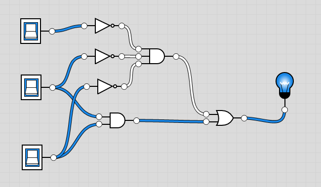
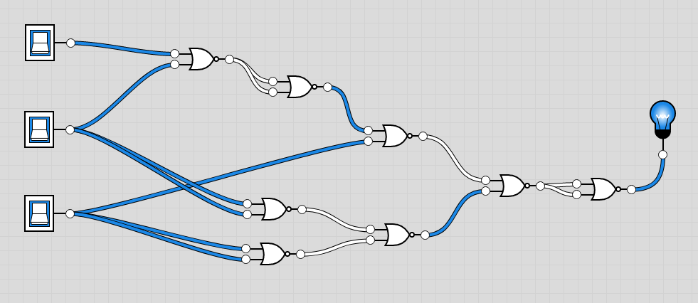

## Termin 4: Hardware mal ohne VHDL
### Aufgabe 1: Logik-Tester

### Aufgabe 2: Untersuchung eines einfachen Gatters
Untersuchung eines OR-Gatters, ausgewählter IC:
>IC: 74LS32 (4 ODER-Gatter mit je 2 Eingängen)

### Aufgabe 3: Implementierung einer booleschen Funktion

> f3: y <= (b and c) or ((not a) and (not b) and (not c))

| a | b | c | y |
|---|---|---|---|
| 0 | 0 | 0 | 1 |
| 0 | 0 | 1 | 0 |
| 0 | 1 | 0 | 0 |
| 0 | 1 | 1 | 1 |
| 1 | 0 | 0 | 0 |
| 1 | 0 | 1 | 0 |
| 1 | 1 | 0 | 0 |
| 1 | 1 | 1 | 1 |



### Knobelaufgabe: Bauen Sie die Funktion aus der vorherigen Aufgabe 3 mit nur 2 ICs auf
> 8x NOR (-> realisierbar mit 2x 74LS02)
> 


```
y = (b and c) or ((not a) and (not b) and (not c))

y = (bc)        + ((a)' (b)' (c)')
y = (bc)''      + (a + b + c)'
y = (b' + c')'  + ((a + b)'' + c)'
y = ((b' + c')' + ((a + b)'' + c)')''
```