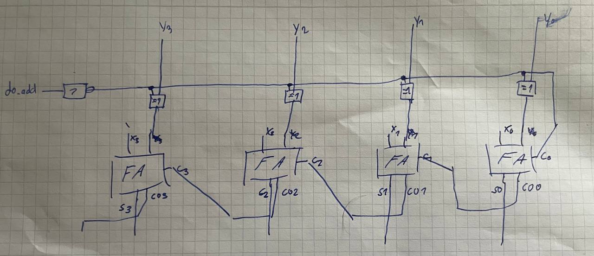

## Termin 7: Addierer und Subtrahierer

### Aufgabe 1: Erstellen Sie eine Entity "volladdierer" mit Testbench

- [half_add.vhdl](aufgabe_1/half_add.vhdl)
- [full_add.vhdl](aufgabe_1/full_add.vhdl)
- [full_add_tb.vhdl](aufgabe_1/full_add_tb.vhdl)

### Aufgabe 2:  Erstellen Sie einen 4-Bit-Volladdierer

- [add4.vhdl](aufgabe_2/add4.vhdl)

### Knobelaufgabe: Subtrahierer

- [addsub4.vhdl](knobelaufgabe/addsub4.vhdl)

